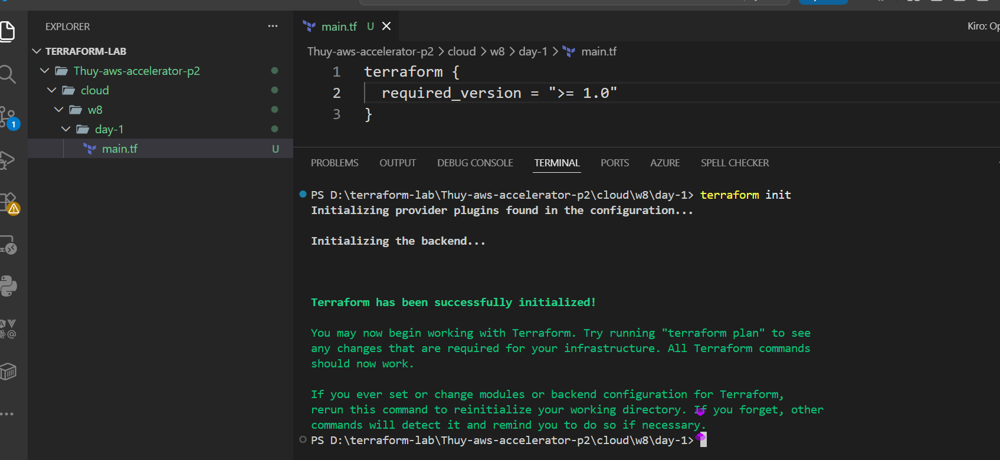
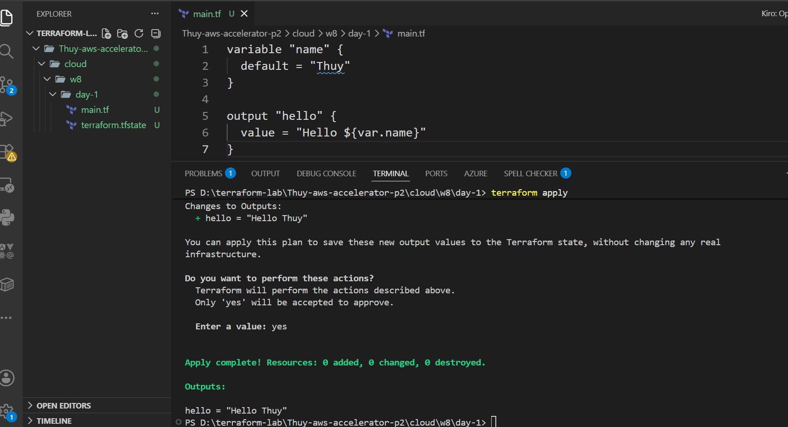
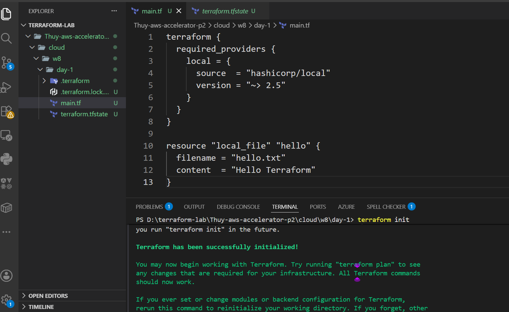
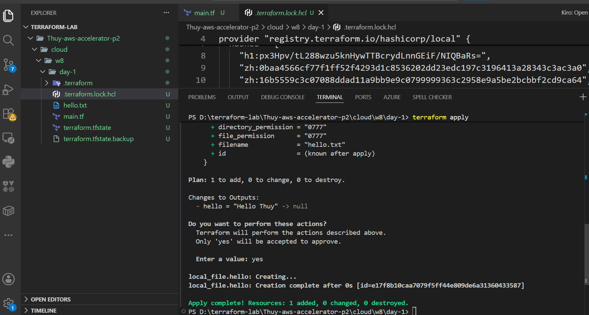

# W8 - Day 1 Reflection (Terraform Fundamentals)

## Mục tiêu học tập

Tìm hiểu tổng quan về Infrastructure as Code (IaC) và cú pháp cơ bản của Terraform (HCL).

## Những gì đã thực hiện

### 1. Cài đặt và khởi tạo Terraform

* Cài đặt Terraform trên Windows.
* Cấu hình biến môi trường PATH để sử dụng Terraform từ PowerShell.
* Khởi tạo dự án Terraform bằng lệnh `terraform init`.

**Evidence:**

### 2. Thực hành Variable và Output

* Thực hành khai báo `variable` và `output`.
* Thực hiện `terraform apply` thành công và nhận được kết quả output.

**Evidence:**

### 3. Thực hành Provider và Resource

* Tìm hiểu Local Provider.
* Tạo resource `local_file`.
* Sinh file `hello.txt` bằng Terraform.

**Evidence:**

### 4. Tìm hiểu Terraform State

* Tìm hiểu cách Terraform lưu trạng thái thông qua file `terraform.tfstate`.

## Kiến thức đã học được

* Terraform là công cụ Infrastructure as Code giúp quản lý hạ tầng bằng code thay vì thao tác thủ công.
* Terraform sử dụng HCL (HashiCorp Configuration Language) để định nghĩa hạ tầng.
* Provider giúp Terraform kết nối với các nền tảng hoặc dịch vụ khác nhau.
* Resource là đối tượng mà Terraform quản lý hoặc tạo ra.
* Variable giúp tái sử dụng và dễ dàng thay đổi giá trị cấu hình.
* Output dùng để hiển thị kết quả sau khi thực thi.
* File `terraform.tfstate` được dùng để lưu trạng thái hiện tại của infrastructure.

Ngoài ra, em đã tìm hiểu cơ bản về Terraform Workflow:

* `terraform init`: Khởi tạo working directory và tải các provider cần thiết.
* `terraform plan`: Xem trước những thay đổi Terraform sẽ thực hiện.
* `terraform apply`: Thực thi các thay đổi lên infrastructure.
* `terraform destroy`: Xóa các resource được Terraform quản lý.

## Khó khăn gặp phải

* Ban đầu gặp khó khăn trong việc cấu hình PATH cho Terraform trên Windows nhưng đã xử lý được.
* Chưa hiểu rõ cách Terraform quản lý State và sự khác nhau giữa Provider và Resource, em sẽ tìm hiểu thêm trong thời gian tới.

## Kế hoạch cho ngày tiếp theo

* Tìm hiểu sâu hơn về Terraform Workflow.
* Học State Management.
* Tìm hiểu Terraform Modules.
* Đọc thêm về Best Practices trong Terraform.
* Chuẩn bị cho Online Test 1.
