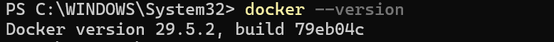
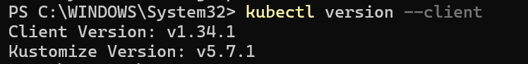
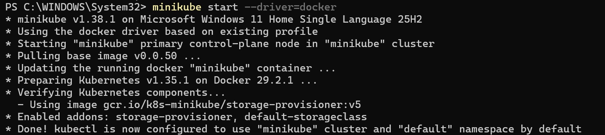
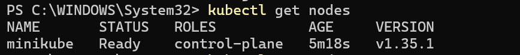
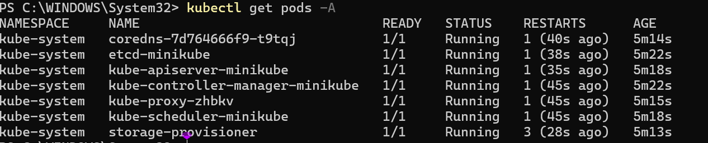

# W8 - Day 2 Reflection (Kubernetes Fundamentals)

## Mục tiêu học tập

Tìm hiểu kiến thức nền tảng về Container và Kubernetes Orchestration. Làm quen với các khái niệm cơ bản trong Kubernetes như Pod, Service, ConfigMap, Secret và Network Policy. Cài đặt môi trường thực hành gồm Docker Desktop, Minikube và Kubectl.

---

## Những gì đã thực hiện

### 1. Tìm hiểu về Container và Kubernetes

* Đọc tài liệu về Container và sự khác biệt giữa Virtual Machine và Container.
* Tìm hiểu vai trò của Kubernetes trong việc quản lý và điều phối container.
* Hiểu được các lợi ích của Kubernetes như tự động triển khai, mở rộng và quản lý ứng dụng.

### 2. Tìm hiểu các thành phần cơ bản của Kubernetes

* Tìm hiểu khái niệm Pod – đơn vị triển khai nhỏ nhất trong Kubernetes.
* Tìm hiểu Service – cung cấp kết nối mạng ổn định cho Pod.
* Tìm hiểu ConfigMap và Secret để quản lý cấu hình và dữ liệu nhạy cảm.
* Tìm hiểu Network Policy để kiểm soát lưu lượng mạng giữa các Pod.

### 3. Cài đặt môi trường thực hành Kubernetes

* Cài đặt Docker Desktop.
* Cài đặt Kubectl để quản lý Kubernetes Cluster.
* Cài đặt Minikube để chạy Kubernetes trên máy cá nhân.
* Khởi động thành công Kubernetes Cluster bằng Minikube với Docker Driver.
* Kiểm tra trạng thái Cluster và các thành phần hệ thống Kubernetes.

#### Evidence: Docker Version



#### Evidence: Kubectl Version



#### Evidence: Minikube Start



### 4. Làm quen với Kubectl

* Tìm hiểu chức năng của Kubectl.
* Thực hành các lệnh cơ bản để kiểm tra Cluster:

```bash
kubectl version --client
kubectl get nodes
kubectl get pods -A
```

* Kiểm tra Node của Cluster ở trạng thái `Ready`.
* Kiểm tra các Pod hệ thống trong namespace `kube-system` đang hoạt động bình thường.

#### Evidence: Get Nodes



#### Evidence: Get Pods



---

## Kiến thức đã học được

* Container giúp đóng gói ứng dụng và môi trường chạy thành một đơn vị thống nhất, giúp ứng dụng hoạt động nhất quán trên nhiều môi trường khác nhau.
* Kubernetes là nền tảng điều phối container giúp tự động triển khai, quản lý và mở rộng ứng dụng.
* Pod là đơn vị triển khai nhỏ nhất trong Kubernetes và có thể chứa một hoặc nhiều container.
* Service cung cấp cơ chế truy cập ổn định đến các Pod.
* ConfigMap được sử dụng để lưu trữ cấu hình ứng dụng.
* Secret được sử dụng để lưu trữ dữ liệu nhạy cảm như mật khẩu, token hoặc API Key.
* Network Policy giúp kiểm soát và giới hạn lưu lượng mạng giữa các Pod trong Cluster.
* Kubectl là công cụ dòng lệnh dùng để tương tác với Kubernetes Cluster.
* Minikube cho phép tạo và vận hành một Kubernetes Cluster cục bộ trên máy tính cá nhân để học tập và thực hành.

Ngoài ra, em đã hiểu được quy trình cơ bản để khởi động và kiểm tra một Kubernetes Cluster:

```bash
minikube start --driver=docker
kubectl get nodes
kubectl get pods -A
```

---

## Khó khăn gặp phải

* Ban đầu gặp khó khăn khi tìm hiểu các khái niệm mới như Pod, Service, ConfigMap và Secret vì chưa hình dung rõ cách chúng phối hợp với nhau trong thực tế.
* Việc cài đặt môi trường cần nhiều bước và phải kiểm tra sự tương thích giữa Docker Desktop, Kubectl và Minikube.
* Chưa thực sự hiểu sâu về Network Policy và cách Kubernetes xử lý networking giữa các Pod.
* Cần thêm thời gian thực hành để làm quen với các lệnh Kubectl và cấu trúc của Kubernetes Cluster.

---

## Kế hoạch cho ngày tiếp theo

* Ôn tập lại các khái niệm Kubernetes đã học.
* Tìm hiểu thêm về Kubernetes Networking và Scaling.
* Hoàn thành nội dung Terraform State Management, Modules và Best Practices.
* Chuẩn bị các câu hỏi liên quan đến Terraform cho buổi Live Session với mentor.
* Luyện tập thêm các lệnh Kubectl để quản lý tài nguyên trong Kubernetes.
* Chuẩn bị cho Online Test 1.

---

## Kết luận

Hôm nay em đã hoàn thành việc cài đặt thành công môi trường Kubernetes gồm Docker Desktop, Kubectl và Minikube. Đồng thời em cũng nắm được các khái niệm nền tảng của Kubernetes và thực hiện thành công việc khởi động Cluster, kiểm tra Node và Pod bằng Kubectl. Đây là nền tảng quan trọng để em tiếp tục thực hành triển khai ứng dụng trên Kubernetes trong các buổi lab tiếp theo.
