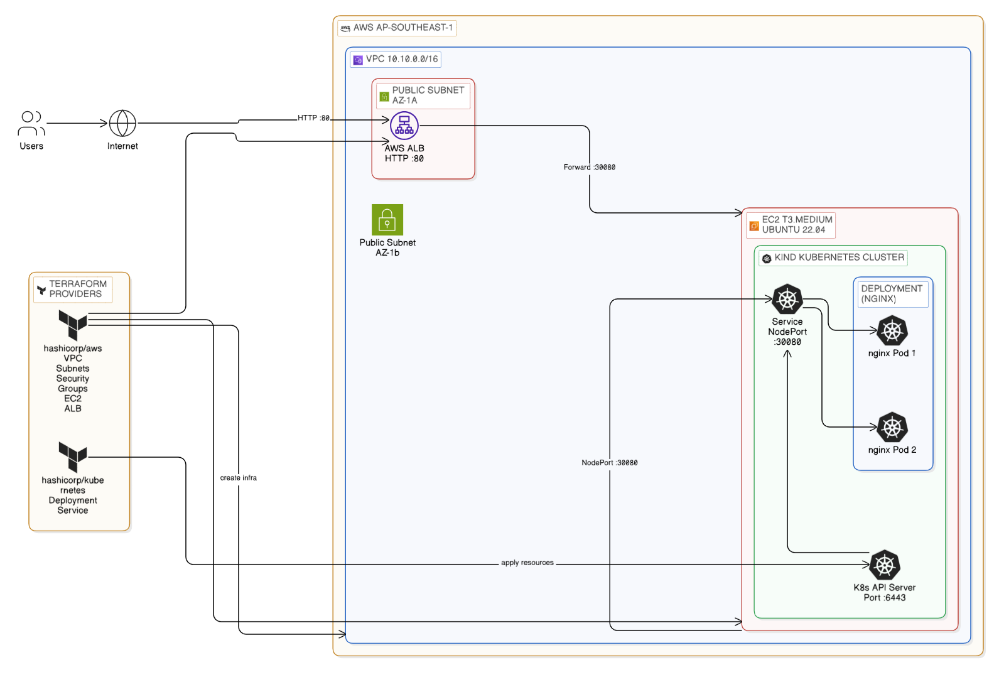
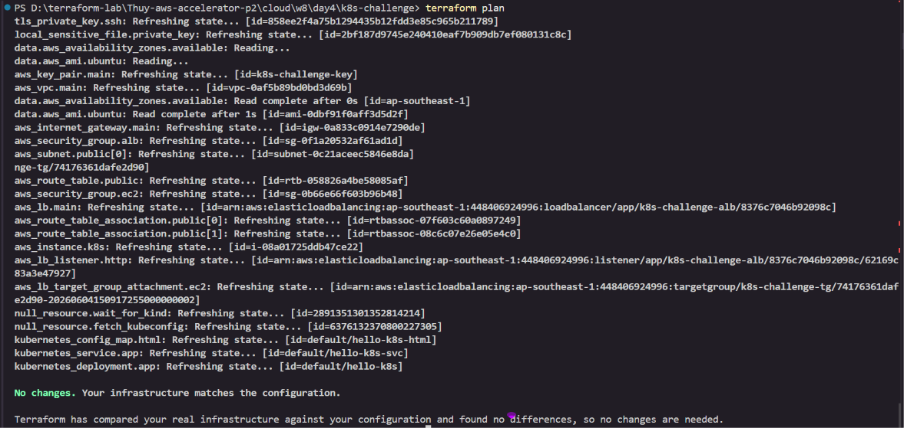
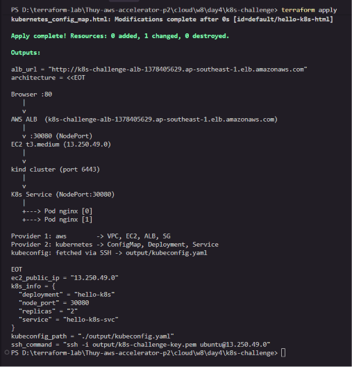
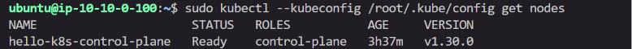
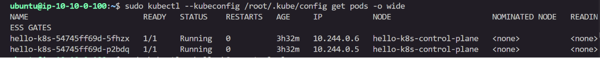
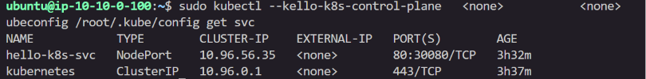
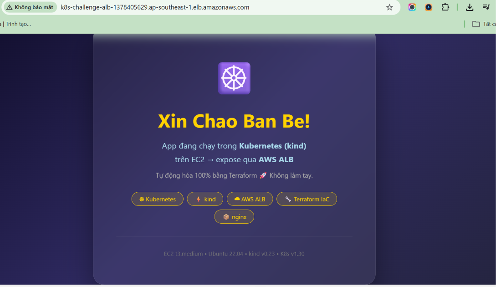

# K8s trên AWS — Terraform 1-Click

## Tổng Quan

Dự án này triển khai môi trường Kubernetes trên AWS bằng Terraform.

**Tính năng:**
- Hạ tầng AWS được dựng hoàn toàn bằng Terraform
- Cụm Kubernetes chạy bằng Kind trên EC2
- Ứng dụng Nginx chạy bên trong Kubernetes
- Ứng dụng được expose ra Internet qua AWS ALB
- Kiến trúc đa provider Terraform (AWS + Kubernetes)

---

## Sơ Đồ Kiến Trúc

```
Internet
     ↓ ALB :80
     ↓ EC2 :30080
     ↓ Kind Cluster
     ↓ NodePort Service
     ↓ Nginx Pods
```



---

## Cách Wire Provider

### Provider 1 — AWS
Chịu trách nhiệm:
- VPC
- Public Subnets
- Security Groups
- EC2
- Application Load Balancer

### Provider 2 — Kubernetes
Chịu trách nhiệm:
- Deployment
- Service

**Luồng thực thi Terraform:**

```
terraform apply
        │
        ▼
AWS Provider
        │
        ▼
EC2 + Kind Cluster
        │
        ▼
Kubernetes Provider
        │
        ▼
Deployment + Service
```

**Cơ chế wire hoạt động như thế nào:**

`kubernetes` provider cần kết nối vào cluster chưa tồn tại lúc bắt đầu `plan`. Cầu nối là file kubeconfig được fetch về máy local qua SSH:

1. `aws_instance` khởi động với `user_data` → cài Docker + kind → cluster sẵn sàng
2. `null_resource.wait_for_kind` → SSH vào EC2, poll `kubectl get nodes` cho đến khi `Ready`
3. `null_resource.fetch_kubeconfig` → SSH copy `/root/.kube/config` về `output/kubeconfig.yaml` (patch `0.0.0.0` → EC2 public IP)
4. `kubernetes` provider đọc `output/kubeconfig.yaml` → kết nối vào kind API trên port `6443`
5. `kubernetes_deployment` + `kubernetes_service` được tạo

```hcl
provider "kubernetes" {
  host     = yamldecode(file("output/kubeconfig.yaml"))["clusters"][0]["cluster"]["server"]
  insecure = true  # kind cert không có SAN cho public IP
  client_certificate = base64decode(...)
  client_key         = base64decode(...)
}
```

> **Tại sao `insecure = true`?**  
> kind tự ký TLS cert chỉ ghi SAN cho internal IP (`172.18.0.2`, `0.0.0.0`).  
> Kết nối từ ngoài qua public IP khiến cert không match → cần bỏ qua xác thực TLS.

---

## Triển Khai

**Khởi tạo Terraform:**

```bash
terraform init
```

**Xem trước các thay đổi:**

```bash
terraform plan
```

**Bằng chứng:**



**Triển khai hạ tầng và ứng dụng:**

```bash
terraform apply
```

**Kết quả mong đợi:**

```
Apply complete! Resources: X added, 0 changed, 0 destroyed.
```

**Bằng chứng:**



---

## Kiểm Tra

### Kiểm tra Kubernetes Node

**Lệnh:**
```bash
sudo kubectl --kubeconfig /root/.kube/config get nodes
```

**Kết quả mong đợi:**
```
hello-k8s-control-plane   Ready
```

**Bằng chứng:**



---

### Kiểm tra Pod đang chạy

**Lệnh:**
```bash
sudo kubectl --kubeconfig /root/.kube/config get pods -o wide
```

**Kết quả mong đợi:**

2 nginx pod ở trạng thái `Running`

**Bằng chứng:**



---

### Kiểm tra Service

**Lệnh:**
```bash
sudo kubectl --kubeconfig /root/.kube/config get svc
```

**Kết quả mong đợi:**
```
hello-k8s-svc   NodePort   80:30080/TCP
```

**Bằng chứng:**



---

### Kiểm tra truy cập ứng dụng

**Lấy URL của ALB:**
```bash
terraform output alb_url
```

**Mở trên trình duyệt:**
```
http://<alb-url>
```

**Kết quả mong đợi:**

Trang ứng dụng hiển thị thành công

**Bằng chứng:**



---

## Outputs

Xem tất cả outputs:

```bash
terraform output
```

Các giá trị có sẵn:
```
alb_url
ec2_public_ip
ssh_command
kubeconfig_path
```

---

## Dọn Dẹp

**Xóa toàn bộ tài nguyên AWS:**

```bash
terraform destroy
```

> **Lưu ý quan trọng:** Luôn destroy tài nguyên sau khi kiểm tra xong để tránh phát sinh chi phí AWS.
